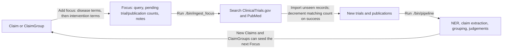

# Trials Publications Claims

This proof of concept turns ClinicalTrials.gov and PubMed records into source-tracked biomedical claims. It links trials to publications, extracts and normalizes disease and intervention entities, identifies evidence-backed claims, evaluates whether their sources support them, groups related claims, and exposes the provenance chain for human review. Saved Focus queries can request one-time imports of new trials and publications based on those disease and intervention terms.

The included colorectal-cancer workflow is anchored on ClinicalTrials.gov record `NCT03026140` and its related PubMed evidence. The system runs locally with Docker Compose and stores source records, derived evidence, review state, and provenance in PostgreSQL.


[Quick start](#quick-start) · [Demo workflow](#demo-workflow) · [Focus ingestion](#focus-ingestion) · [System diagram](#system-diagram) · [Models](#models) · [Screenshots](docs/illustrations/) · [POC boundaries](#proof-of-concept-boundaries)

## Quick Start

### Prerequisites

- Docker with Docker Compose
- A Meta Model API key for structured claim extraction and evidence summaries
- A TypeSafe API key for Jev judgements
- An NCBI API key is recommended for PubMed access

Copy the credential template and populate the values without committing the resulting secrets file:

```sh
cp etc/secrets/.env.example etc/secrets/.env
```

| Variable | Used for |
|---|---|
| `LLM_API_KEY` | Muse Spark claim extraction and claim-group evidence summaries |
| `TYPESAFE_API_KEY` | Jev source-support judgements |
| `NCBI_API_KEY` | PubMed access and higher NCBI request limits |

Install the environment and start the services:

```sh
./bin/install

./bin/start
```

Open the [Web workspace](http://localhost:8001), or run the test suite with:

```sh
./bin/test
```

### Optional: Graphify codebase navigation

Graphify is optional local tooling. Its generated `graphify-out/` directory and
Git hook configuration are intentionally not committed. Install the pinned
development tool, configure hooks for the active Python environment, then build
the initial local graph:

```sh
python3 -m pip install -r etc/requirements-dev.txt
./bin/setup_graphify
./bin/graphify update .
```

Use `./bin/graphify query "<question>"` for architecture, dependency, and
change-impact investigations. Hooks refresh the local graph after commits and
branch switches; run `./bin/graphify update .` after uncommitted edits when you
need a current graph before querying. Set `GRAPHIFY_SKIP_HOOK=1` for a single
commit or checkout when an automatic refresh is not wanted.

## Demo Workflow

1. Open the workspace's **Sources** tab and search ClinicalTrials and Publications, to add sources to the system.
2. Fetch the trial with its referenced publications. The system stores the raw source responses, structured records, and trial-publication relationships.
3. Run the enrichment pipeline:

   ```sh
   ./bin/pipeline
   ```

4. Inspect the resulting NER mentions, normalized diseases and interventions, evidence-backed claims, Jev judgements, and claim groups.
5. Review a claim beside its exact source section and mark it `pending`, `approved`, or `rejected` with notes. When status or notes actually change, the system saves a `ClaimTrails` audit record with the prior and new status and a JSON snapshot of the claim, its NERs, diseases, and interventions. Saving without changing either field creates no trail.
6. Compare the distinct trial and publication counts on a claim group to see whether its claims span multiple source records.
7. Open **claim trails** from a trial or publication detail to inspect and expand saved snapshots. Re-fetch an existing source when its upstream record changes, then rerun the pipeline; review trails remain available while derived records are regenerated.

## Focus Ingestion

A Focus is a saved search query with separate one-time pending counts for trials and publications, plus notes. Create one from a Claim or ClaimGroup with **Add focus**: the workspace alphabetizes the disease names, then the intervention names, and joins them into a query. If that query already exists, the workspace links to the existing Focus instead of creating a duplicate. The **Focuses** tab, after **Sources**, lets you review and edit the query, pending counts, and notes.

Run the focused importer in the active Django container:

```sh
./bin/ingest_focus
```

For each Focus with a positive pending count, the job searches ClinicalTrials.gov or PubMed and imports up to that many previously absent records. Existing database records do not consume the count. Each successfully saved new record decrements its corresponding count by one; a failed import or exhausted search leaves the remaining count pending for a later run. Trial imports do not fetch publications referenced by the trial. Run `./bin/pipeline` afterward to analyze newly imported records.

## System Diagram

[View application screenshots](docs/illustrations/)

```text
┌────────────────────────────── PUBLIC DATA SOURCES ──────────────────────────────┐
│                                                                                 │
│     ClinicalTrials.gov API                          PubMed API                   │
│     • Trial registry records                       • Publications               │
│     • Conditions/interventions                     • Abstracts and metadata     │
│     • Referenced PMIDs                             • Referenced NCT IDs          │
│                                                                                 │
└─────────────────┬─────────────────────────────────────┬─────────────────────────┘
                  │ Search and fetch                    │ Search and fetch
                  ▼                                     ▼
┌──────────────────────────── SOURCE INGESTION ───────────────────────────────────┐
│                                                                                 │
│  Parse and upsert Trial                    Parse and upsert Publication          │
│  • Structured fields                       • Structured fields                  │
│  • Complete raw API response               • Complete raw API response          │
│  • Source identifier: NCT ID               • Source identifier: PMID            │
│                                                                                 │
│                 Link related records using references                           │
│                                                                                 │
│        Trial ◄──────── PublicationTrial + relation ────────► Publication         │
│                                                                                 │
└──────────────────────────────────┬──────────────────────────────────────────────┘
                                   │
                                   ▼
┌──────────────────────────── TEXT PREPARATION ───────────────────────────────────┐
│                                                                                 │
│  Trial sections                              Publication sections               │
│  • Title                                     • Title                            │
│  • Official title                            • Abstract                         │
│  • Summary                                                                      │
│  • Detailed description                                                        │
│  • Eligibility criteria                                                        │
│                                                                                 │
│           Long sections are split into overlapping, ordered chunks              │
│                                                                                 │
│       Source ──► Section ──► Chunk {section, sequence, exact source text}        │
│                                                                                 │
└──────────────────────────────────┬──────────────────────────────────────────────┘
                                   │
                                   ▼
┌──────────────────────── NAMED-ENTITY RECOGNITION ───────────────────────────────┐
│                                                                                 │
│        OpenMed models + GLiNER-BioMed + HunFlair2                               │
│                                   │                                             │
│                                   ▼                                             │
│  NER mention                                                                    │
│  • Exact text span                         • Model and extraction method         │
│  • Section and chunk                       • External terminology links         │
│  • Start/end offsets                       • Confidence score                    │
│  • Labels: disease, cancer, drug, chemical, etc.                                │
│                                   │                                             │
│                     Normalize and connect entities                              │
│                       ┌───────────┴───────────┐                                 │
│                       ▼                       ▼                                 │
│                    Disease               Intervention                           │
│                                                                                 │
└──────────────────────────────────┬──────────────────────────────────────────────┘
                                   │
                                   ▼
┌──────────────────────────── CLAIM EXTRACTION ───────────────────────────────────┐
│                                                                                 │
│     One section/chunk + its NER mentions are submitted to the claim LLM         │
│                                   │                                             │
│                                   ▼                                             │
│  Extract only explicit positive claims of:                                      │
│                                                                                 │
│                 “Intervention worked for Disease”                               │
│                                                                                 │
│  Validation gates                                                               │
│  • Evidence must be a verbatim excerpt from the supplied text                   │
│  • Returned NER IDs must exist in that section/chunk                            │
│  • Objectives, hypotheses, co-mentions and negative results are excluded        │
│                                   │                                             │
│                                   ▼                                             │
│  Candidate Claim                                                                │
│  • Claim type                              • Disease(s) and intervention(s)      │
│  • Evidence excerpt                        • Linked NER mentions                 │
│  • Trial or publication                    • Status: pending                     │
│  • Exact section/chunk                                                           │
│                                                                                 │
└───────────────────────────┬──────────────────────┬──────────────────────────────┘
                            │                      │
                            ▼                      ▼
┌─────────────────────────────────────┐   ┌───────────────────────────────────────┐
│ CLAIM JUDGEMENT                     │   │ CLAIM GROUPING                        │
│                                    │   │                                       │
│ Claim + analyzed source fields      │   │ Match the complete normalized sets of │
│              │                     │   │ diseases and interventions.           │
│              ▼                     │   │                 │                     │
│ System-One / Jev                   │   │                 ▼                     │
│                                    │   │ ClaimGroup                            │
│ • Supports                         │   │ • Matching claims                     │
│ • Contradicts                      │   │ • Evidence summary                    │
│ • Unaddressed                      │   │ • Related trials                      │
│ • Source-support probability       │   │ • Related publications                │
│                                    │   │ • Maximum judgement score             │
└──────────────────┬──────────────────┘   └───────────────────┬───────────────────┘
                   │                                          │
                   └────────────────────┬─────────────────────┘
                                        ▼
┌──────────────────────── SOURCE-TRACKED EVIDENCE STORE ──────────────────────────┐
│                                                                                 │
│  PostgreSQL evidence graph                                                      │
│                                                                                 │
│  Trial ◄────► Publication                                                       │
│    │               │                                                            │
│    └──► Section / Chunk ◄── NER mention ◄── Disease / Intervention              │
│                 │                                                               │
│                 └──► Claim ──► Judgement                                        │
│                        │                                                        │
│                        └──► ClaimGroup                                           │
│                                                                                 │
│  Trial and/or Publication ──► ClaimTrails                                      │
│  meta: Claim + NERs + diseases + interventions                                  │
│  Review: previous/new status and notes                                          │
│  Snapshot remains when derived claim analysis is re-fetched                     │
│                                                                                 │
│  Focus: query + pending trial/publication counts + notes                        │
│  Saved search settings; successful new imports consume one pending count        │
│                                                                                 │
│  Every candidate claim remains connected to the source text that produced it.  │
│  ClaimTrails keep source references and a copy of claim details in meta.        │
│                                                                                 │
└──────────────────────────────────┬──────────────────────────────────────────────┘
                                   │
                                   ▼
┌──────────────────────────── HUMAN REVIEW WORKSPACE ─────────────────────────────┐
│                                                                                 │
│  Browse and search                                                              │
│  • Sources, trials and publications       • Diseases and interventions          │
│  • Claims and claim groups                • Evidence excerpts and source text    │
│  • NER provenance                        • Jev judgements                       │
│  • Focuses tab (after Sources)                                                  │
│                                                                                 │
│  Reviewer action                                                                │
│  • Inspect the exact supporting section/chunk                                   │
│  • Mark claim pending, approved or rejected                                     │
│  • Add review notes                                                             │
│  • Changed status or notes create a ClaimTrails snapshot                        │
│  • Add a Focus from Claim/ClaimGroup disease and intervention terms             │
│                                                                                 │
└─────────────────────────────────────────────────────────────────────────────────┘
```

The central evidence flow is:

```text
PUBLIC SOURCE
    → CURRENT SOURCE RECORD
    → SECTION/CHUNK
    → NER MENTIONS
    → NORMALIZED ENTITIES
    → EVIDENCE-BACKED CLAIM
    → SOURCE-SUPPORT JUDGEMENT
    → ENTITY-MATCHED CLAIM GROUP
    → HUMAN REVIEW
         └─ changed status or notes → CLAIM TRAIL + JSON snapshot
```

Claim groups are formed from exact disease and intervention entity sets. They are evidence-synthesis containers, not proof of independent replication: multiple claims may come from one source, and multiple publications may describe the same underlying trial. The workspace therefore reports distinct trial and publication counts separately from the number of claims.

Focus ingestion creates a user-driven feedback loop from reviewed claims back to new source searches. After new records are imported, run the pipeline; the resulting Claims and ClaimGroups can be used to create another Focus. The loop is manual: neither search nor pipeline runs automatically.



Existing database records are skipped, failed imports and unfilled counts remain pending, and importing a trial does not fetch its referenced publications.

## Models

### Local named-entity recognition and linking

- [OpenMed DiseaseDetect PubMed 335M](https://huggingface.co/OpenMed/OpenMed-NER-DiseaseDetect-PubMed-335M) detects disease mentions.
- [OpenMed PharmaDetect PubMed 335M](https://huggingface.co/OpenMed/OpenMed-NER-PharmaDetect-PubMed-335M) detects pharmaceutical and chemical mentions.
- [OpenMed PathologyDetect PubMed 335M](https://huggingface.co/OpenMed/OpenMed-NER-PathologyDetect-PubMed-335M) detects pathology concepts.
- [OpenMed OncologyDetect PubMed 335M](https://huggingface.co/OpenMed/OpenMed-NER-OncologyDetect-PubMed-335M) detects oncology concepts.
- [GLiNER-BioMed Large v1.0](https://huggingface.co/Ihor/gliner-biomed-large-v1.0) performs open biomedical NER using the system's requested labels.
- [HunFlair2 NER](https://huggingface.co/hunflair/hunflair2-ner) provides biomedical entity recognition.
- [HunFlair2 disease linker](https://flairnlp.github.io/flair/master/tutorial/tutorial-hunflair2/linking.html) normalizes disease mentions to identifiers such as MeSH IDs.

### Hosted claim extraction and evidence synthesis

- [Meta Muse Spark 1.3 Contributor](https://dev.meta.ai/models/muse-spark) performs structured claim extraction and summarizes evidence within claim groups. The configured model ID is `muse-spark-1.3-contributor`.

The Contributor tier permits prompts and completions to be used to improve Meta's products. The current POC processes public-source text; use the standard tier or another approved deployment for private, sensitive, or regulated data.

### Hosted claim judgement

- [TypeSafe Jev](https://typesafe.ai/blog/introducing-system-one-models-and-jev) is called through the System One API to classify each claim as supported, contradicted, or unaddressed and return calibrated probabilities. The SDK selects the available service model, and the model identifier returned by the API is stored with each judgement.

## Re-fetch and Regeneration

The workspace can re-fetch an existing trial or publication. The operation:

1. Fetches the upstream record and verifies that its NCT ID or PMID matches the requested record.
2. Locks the local source record while applying the refresh.
3. Removes the source's derived claims, NER mentions, and entity associations.
4. Upserts the refreshed source and rebuilds its chunks.
5. Preserves shared disease, intervention, and unrelated source records.
6. Leaves the refreshed source ready for `./bin/pipeline` to regenerate NER, claims, claim groups, summaries, and judgements.

Re-fetch replaces the current derived analysis rather than preserving old Claim, NER, or entity rows. `ClaimTrails` are separate source-linked audit records, so a trial or publication re-fetch can delete those derived rows while its review history and JSON snapshots remain available from the source detail's **claim trails** modal. Trails are created only when a reviewer changes claim status or notes; a no-op save creates none.

## Directory Structure

```text
./
├── bin/            # Executable host scripts (install, start, stop, test, manage, makemigrations, migrate, pipeline, ingest_focus)
├── jobs/           # Scripts run inside the container (pipeline.py, ingest_focus.py)
├── etc/            # Environment configs (.env, requirements.txt, secrets/)
├── dockerfiles/    # Dedicated Dockerfiles for Jupyter and Django
├── django_app/     # Django app with domain models and common lib/
│   ├── core/       # API, UI, and models for sources, chunks, NER, entities, claims, groups, judgements, and claim trails
│   └── lib/        # Source clients, extraction, linking, grouping, judgement, logging, and re-fetch workflows
├── docs/           # Notes and application screenshots
├── notebooks/      # Jupyter notebooks with code examples and autoreload
└── tests/          # Integration and environment test suites
```

## Management Scripts (`bin/`)

All operations are handled via scripts in `bin/`:

- `./bin/install`: Builds Docker images, initializes PostgreSQL, runs database migrations, and preloads the biomedical NER models. Runtime defaults come from the tracked `etc/.env`; credentials come from the ignored `etc/secrets/.env`.
- `./bin/start`: Starts all services (`postgres`, `django-app`, `jupyter`) in the background.
- `./bin/stop`: Stops all containers (accepts `-v` to prune volumes).
- `./bin/test`: Runs environment verification and Django unit tests in disposable test databases; it does not write to the development database.
- `./bin/manage [cmd]`: Runs Django `manage.py` commands inside the Django container (e.g. `./bin/manage migrate`).
- `./bin/makemigrations [args]`: Creates new migrations inside the running Django container using `docker compose exec`.
- `./bin/migrate [args]`: Runs database migrations inside the running Django container using `docker compose exec`.
- `./bin/pipeline`: Runs `jobs/pipeline.py` inside the already-running Django container using `docker compose exec -T django-app`. Requires `./bin/start` first.
- `./bin/ingest_focus`: Searches for and imports new records requested by saved Focus counts inside the running Django container. Each successful new Trial or Publication decrements its own pending count; it does not fetch trial-referenced publications. Requires `./bin/start` first.
- `bin/preload_models.py`: Container-side helper used by `./bin/install` to preload biomedical NER models into the shared cache.

## Pipeline Jobs (`jobs/`)

`jobs/pipeline.py` runs inside the Django container via `./bin/pipeline`. 

The pipeline analyzes records already in the database. Source search and imports can happen through the workspace or notebooks; saved Focus searches can be processed with `./bin/ingest_focus`.

Usage:

```sh
./bin/start

./bin/pipeline
```

## Access Endpoints

- **JupyterLab**: [http://localhost:8888](http://localhost:8888)
- **Django Application**: [http://localhost:8001](http://localhost:8001)
- **Status JSON**: [http://localhost:8001/status/](http://localhost:8001/status/)
- **PostgreSQL**: `localhost:5433` (db: `fl_db`, user: `postgres`)

## Code Examples

Notebooks in `notebooks/` demonstrate the interactive workflow (with `%load_ext autoreload`, `%autoreload 2`):

- `sources.ipynb`: PubMed / ClinicalTrials.gov fetching and upserts.
- `ner.ipynb`: NER extraction.
- `claims.ipynb`: claim extraction.
- `judgement.ipynb`: judgement scoring.
- `pipeline.ipynb`: end-to-end sequence (`fetch_and_upsert_trial`, `fetch_trial_publications`, then the nine `jobs/pipeline.py` stages).

## Validation and Tests

`./bin/test` runs environment checks and the Django test suite in disposable test databases, without writing to the development database. Coverage includes source parsing and linking, chunking, NER persistence, entity normalization, claim extraction and grouping, Jev judgement persistence, source re-fetch behavior, REST APIs, CSRF-protected writes, and workspace behavior.

```sh
./bin/test
```

## Proof-of-Concept Boundaries

- Publication analysis currently uses PubMed metadata and abstracts rather than complete article text.
- The implemented claim type is a positive assertion that an intervention worked for a disease; negative, neutral, safety, and mechanistic claim types are not yet modeled separately.
- Claim groups use exact normalized disease and intervention sets. Multiple documents may report the same underlying trial, so publication count is not the same as independent-study count.
- Jev's probability measures whether the supplied source supports a claim; it is not a clinical evidence-strength or risk-of-bias score.
- Re-fetch replaces the current derived analysis; source-linked claim review trails persist, but full historical source snapshots and workflow-run history are not retained.
- Generated claims enter the evidence store as `pending`; the POC supports human review but does not implement authentication or a separate production publication boundary.
- Model quality has not yet been established against a domain-expert-labeled evaluation set.
- Focus counts are one-time ingestion quotas, not recurring schedules. The repository demonstrates local operation, not production cloud infrastructure, job scheduling, or monitoring.

### Intentional POC decisions

- **Text extraction is demonstrated separately from structured source fields.** PubMed records and ClinicalTrials.gov records already provide useful structured lists, such as MeSH terms, chemicals, conditions, interventions, and references. In a production system, those structured fields should be ingested directly and reconciled with entities extracted from free text. For this demonstration, the text-extraction path was emphasized because it is the less straightforward part of the problem and makes NER spans, source sections, and evidence provenance visible. The two approaches should complement each other rather than compete: structured fields provide high-precision candidates, while free-text extraction captures context, relationships, and information absent from structured metadata.
- **The textual input is intentionally limited.** Publication analysis currently uses abstracts, and clinical-trial analysis uses selected textual fields such as titles, summaries, detailed descriptions, and eligibility criteria. Full publication text and broader source sections would provide substantially more evidence, but the processing workflow would remain conceptually the same: fetch, segment, extract, normalize, validate, and review. The main changes would be more source text, more chunks, more extraction cost, and additional source-access and licensing considerations.
- **A hosted, lower-cost LLM is used for the demonstration.** The POC sends bounded source text and recognized NER mentions to a remote model for structured claim extraction and evidence summarization. This task is narrower than open-ended reasoning because the candidate entities and source passage are already supplied; a frontier model is therefore not necessarily required. A production deployment could evaluate a suitable open-weight model for local inference to reduce per-request vendor costs and improve data control.

## Future Platform Work

The POC demonstrates the core source-to-evidence path, but a broader life sciences evidence platform would need additional capabilities. Some of these were intentionally left out because they require more local memory and processing time, larger reference datasets, dedicated evaluation data, and production infrastructure.

### Ontology, vocabulary, and entity normalization

The current system stores extracted diseases, interventions, and other entities largely as normalized names with limited identifiers. A production platform should add a versioned terminology and knowledge-graph layer that can:

- map mentions to canonical concepts and stable external identifiers;
- preserve synonyms, abbreviations, spelling variants, and hierarchical relationships;
- distinguish related but non-equivalent concepts, such as a disease, disease subtype, biomarker, gene, protein, variant, pathway, laboratory test, and phenotype;
- connect concepts across vocabularies such as MeSH, MONDO, SNOMED CT, and OHDSI/Athena vocabularies, together with relevant domain knowledge graphs;
- retain the vocabulary version, mapping method, confidence, and source span for every normalization decision.

This layer would improve the coherence of NER results, make cross-source grouping more reliable, and allow claims to be queried by concept rather than only by surface form. It would also provide the foundation for comparing evidence across diseases, interventions, biomarkers, and mechanisms.

### Broader biomedical entity extraction

The current NER pipeline does not yet provide complete coverage of many entity types. Future extraction should add biomarkers, proteins, genetic variants, pathways, laboratory tests, measurements, endpoints, phenotypes, response and resistance markers, adverse events, and relevant populations.

A practical implementation would combine several approaches:

- domain NER models for genes, proteins, variants, diseases, chemicals, and clinical concepts;
- source-specific models or prompts for trial fields, laboratory results, endpoints, and eligibility criteria;
- deterministic rules and regular expressions for structured patterns such as HGVS variants, `rs` identifiers, gene symbols, and common biomarker formats;
- terminology dictionaries and synonym tables backed by the ontology layer;
- model ensembles that retain the extraction method, model version, confidence, and exact character offsets.

The resulting mentions should be normalized before they are used for grouping or claim extraction. Candidate mappings should remain reviewable rather than being treated as ground truth automatically.

### Expanded claim and relationship types

The current claim workflow focuses on the positive assertion that an intervention worked for a disease.
It is 1 "claim type".
We should add more types.
A broader evidence asset should support a typed claim taxonomy, including examples such as:

- **intervention–disease efficacy (currently)**
- intervention–disease lack of efficacy;
- intervention–biomarker response;
- biomarker or gene–disease association;
- biomarker–treatment response or resistance;
- gene/protein/pathway–intervention mechanism;
- diagnostic, prognostic, or predictive relationships;
- safety, toxicity, adverse-event, and contraindication claims;
- trial population, endpoint, dose, and outcome claims.

Each claim type should define its allowed entity combinations, required evidence fields, and interpretation rules. Claims should also record polarity, negation, uncertainty, temporality, study context, and whether the statement is observed, hypothesized, or mechanistically interpreted.

## License

Licensed under the [Apache License 2.0](LICENSE).
